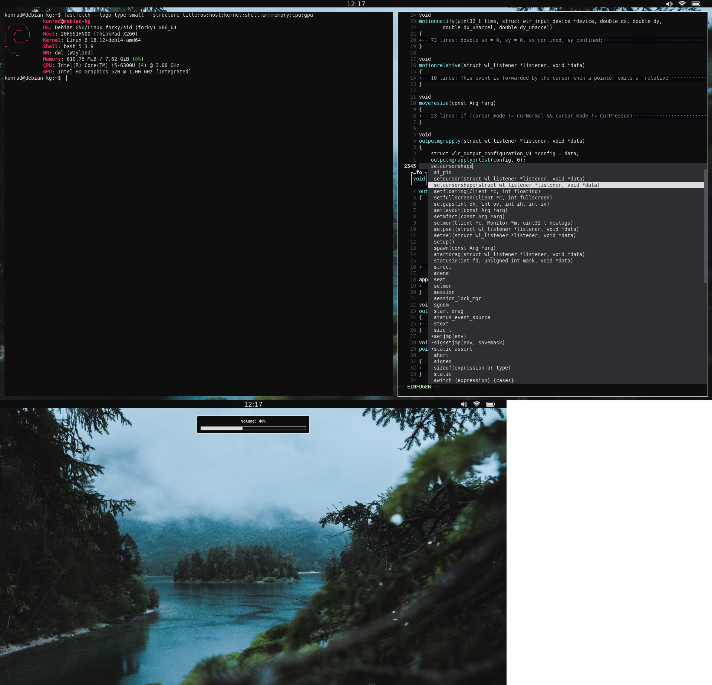

# TL;DR

* Wallpaper [Wallhaven](https://whvn.cc/rqy1mm)
* Terminal [foot](https://codeberg.org/dnkl/foot)
* Screenlocker [wlock](https://github.com/rsalmin/wlock)
* WM [dwl](https://codeberg.org/dwl/dwl)
* Searchbar [mew](https://codeberg.org/sewn/mew)
* Notifications [dunst](https://github.com/dunst-project/dunst)
* Editor [nvim](https://neovim.io/)

# Installation

> [!NOTE]
> Setup installed with [Debian Netinstaller](https://www.debian.org/CD/netinst/)

 ## Sudo and Git

> [!NOTE]
> Login as root

```
apt install sudo git
```
```
usermod -aG sudo konrad
```
```
reboot
```

## Dotfiles

> [!NOTE]
> Login as user

```
git clone https://github.com/gascko/Dotfiles-Wayland.git ~/Dotfiles
```
```
cp ~/Dotfiles/.* ~/
```

## Switching to Debian Testing

> [!NOTE]
> Check Release Name of **Stable** and **Testing** [Debian Release](https://www.debian.org/releases/)

```
sudo sed -i 's/trixie/testing/g' /etc/apt/sources.list
```
```
sudo apt update && sudo apt upgrade
```

## Packages

```
xargs sudo apt -y install < ~/Dotfiles/packages
```
```
sudo reboot
```

## Network

```
managed=true
```
> /etc/NetworkManager/NetworkManager.conf

> [!NOTE]
> If Wifi still not working remove Wifi from /etc/network/interfaces

```
sudo wget https://hosts.ubuntu101.co.za/hosts.deny -O /etc/hosts.deny
```

```
[global-dns-domain-*]
servers=185.228.168.168,185.228.169.168
                       
[global-dns] 
searches=family-filter-dns.cleanbrowsing.org
```

> /etc/NetworkManager/conf.d/dns.conf

## Neovim

```
mkdir -p ~/.local/share/nvim/site/pack/deps/start
```
```
git clone https://github.com/nvim-mini/mini.deps ~/.local/share/nvim/site/pack/deps/start/mini.deps
```
```
cp ~/Dotfiles/nvim/init.lua ~/.config/nvim/
```

## Install dwl

```
git clone https://codeberg.org/dwl/dwl.git ~/.config/
```
```
cp ~/Dotfiles/dwl/* ~/.config/dwl/
```
```
sudo make install
```

## Install mew

```
git https://codeberg.org/sewn/mew.git ~/.config/mew
```
```
make
```
```
sudo make install
```

## Install wlock

```
git https://codeberg.org/sewn/wlock.git ~/.config/wlock
```
```
make
```
```
sudo make install
```

## Install dunst

```
mkdir -p .config/dunst
```
```
cp ~/Dotfiles/dunstrc ~/.config/dunst/
```

## bash

```
cp ~/Dotfiles/.bash_profile ~/
```
```
cp ~/Dotfiles/.bashrc ~/
```

## Grub

```
set GRUB_TIMEOUT=0
```

> /etc/default/grub

```
sudo update-grub2
```

## Browser Darkmode

```
gsettings set org.gnome.desktop.interface color-scheme prefer-dark
```

## Tutanota

```
sudo wget https://app.tuta.com/desktop/tutanota-desktop-linux.AppImage -O /usr/bin/tutanota
```
```
sudo chmod +x /usr/bin/tutanota
```
